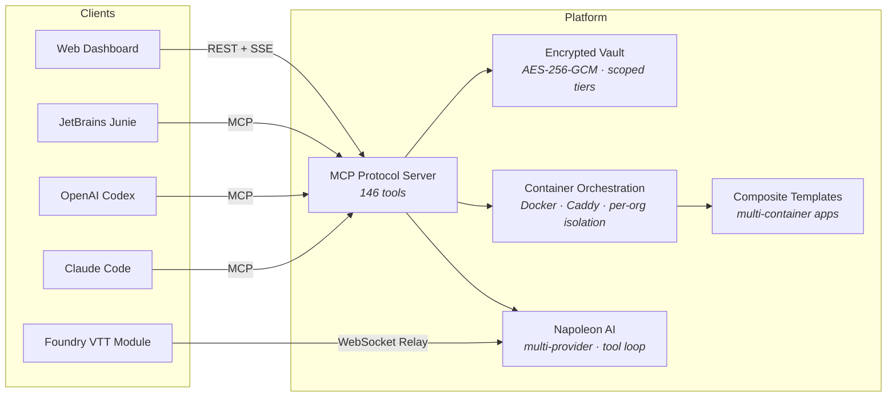

<h1 align="center">Greg Barker</h1>

  <strong>Platform engineer · AI systems · Data analytics</strong> 
  Building tools that give developers (and game masters) superpowers.

  <a href="https://stablepiggy.com">stablepiggy.com</a> · 
  <a href="https://www.linkedin.com/in/greg-barker-savevsgames/">LinkedIn</a> · 
  <a href="https://github.com/savevsgames">GitHub</a>

---

## What I'm building

### StablePiggy DevVault

A multi-tenant developer platform where AI agents operate inside isolated, sandboxed environments — managing containers, vaults, knowledge bases, and deployment pipelines through a unified MCP protocol interface.

Napoleon, the platform's AI assistant, helps developers ship code through managed infrastructure — all within the org-scoped, security-audited system. As a representation of a containerized integration, Napoleon can help game masters run tabletop RPG sessions in Foundry VTT with real module content. Any container run on the platform can be spun up and have integrations built to allow Napoleon to interact with it.

#### Testing & quality

2,800+ automated tests across backend and dashboard. CI runs on every pull request — typecheck, drift guards, migration safety, and security audit gates all enforced before merge.

#### Security

16-phase security audit with zero critical findings. Full threat modeling, GDPR-compliant data lifecycle (erasure cascades, export endpoints), and incident response runbooks. The platform enforces encryption at rest, scoped access tiers, and container-level network isolation out of the box.

#### Multi-container orchestration

Composite template system lets you define multi-container applications with lifecycle-aware volumes — separating runtime services, persistent data, and independently-scaled sidecars. Deploy a full-stack app with one command.

#### Secret management

Encrypted vault with personal, org, and platform tiers. Secrets are injected into containers at runtime, never exposed in chat history or logs. A built-in redaction engine scrubs credentials from stored conversations automatically.

#### AI agent compatibility

Works with Claude Code, Codex, and JetBrains Junie out of the box. Nearly 200 custom MCP tools. The online chat interface supports Anthropic, OpenAI, OpenRouter, and Ollama — pick the model that fits your workflow.

#### Controlled onboarding

Waitlist with seat-capacity management, honeypot defense, and tamper-resistant signup flow. Designed for a measured launch, not a free-for-all.

---

### Napoleon Foundry Module

An AI game master assistant for [Foundry VTT](https://foundryvtt.com/) — available on [Docker Hub](https://hub.docker.com/r/savevsgames/napoleon-foundry) and pending Foundry marketplace review.

Napoleon reads real module content — actors, scenes, journals — from purchased adventure modules and answers questions, builds encounters, places walls and lighting, and manages session continuity. All from inside the Foundry interface, scoped per-user so your game data stays yours.

The module ships as a derived Docker image with version-tracked releases, per-org relay isolation, and clear error handling when something goes wrong (five distinct failure cases, each with an actionable notification instead of a silent failure).

---

### PromptBlocker

A Chrome Extension that automatically replaces your real personal information with aliases when using AI chat services — ChatGPT, Claude, Gemini, Perplexity, and Copilot.

Your prompts go out with aliases, responses come back decoded. Profiles never leave your device. 750 passing tests. Free tier available, Pro at $4.99/mo. Its development shaped the zero-trust privacy approach behind StablePiggy's secret redaction system.

---

## What I've shipped professionally

### Data Analytics & Business Intelligence

Founding member of a consultancy delivering data analytics and BI solutions.

**$2.5M in inventory savings** identified for a consumer goods client through predictive modeling and demand forecasting. Built automated reporting pipelines covering sales orders, production actuals vs. forecast, and material costs. Delivered executive dashboards and actionable recommendations that drove procurement and logistics decisions.

Currently building a Java SaaS application that lets enterprise users safely query their own data in natural language — NLP to SQL with deterministic output.

---

## Stack

What I actually use in production:

| Domain | Technologies |
|--------|-------------|
| **Platform & Infrastructure** | Node.js, TypeScript, Express, SQLite (WAL), Docker, Caddy, pm2, GitHub Actions CI/CD |
| **AI & LLM Integration** | Anthropic Claude, OpenAI, OpenRouter, MCP Protocol, RAG with Voyage embeddings, multi-provider tool loops |
| **Security** | AES-256-GCM encryption, Argon2id hashing, JWT with revocation, HMAC verification, CSP/HSTS, container egress firewalling |
| **Frontend** | React, Vite, Tailwind CSS, SSE streaming, WebSocket |
| **Data & Analytics** | Python, pandas, predictive modeling, BI reporting, demand forecasting |
| **Protocols** | MCP (Model Context Protocol), WebSocket relay, Stripe webhooks, GitHub App webhooks, Foundry VTT module API |

---

## Background

Data Analytics and and Pipeline Architecure Design. Full stack development program at the University of Toronto. E-commerce experience (Shopify store management and Liquid code). Former Master Electrician — the kind of background where you learn that cutting corners on safety gets people hurt, which turns out to be a useful instinct when you're writing security audits and building vault encryption systems.

---

  StablePiggy: <a href="https://stablepiggy.com">stablepiggy.com</a> · 
  <a href="mailto:greg@stablepiggy.com">greg@stablepiggy.com</a> 
  Other Inquiries: <a href="mailto:gregcbarker@gmail.com">gregcbarker@gmail.com</a> · 
  <a href="https://www.linkedin.com/in/greg-barker-savevsgames/">LinkedIn</a>

