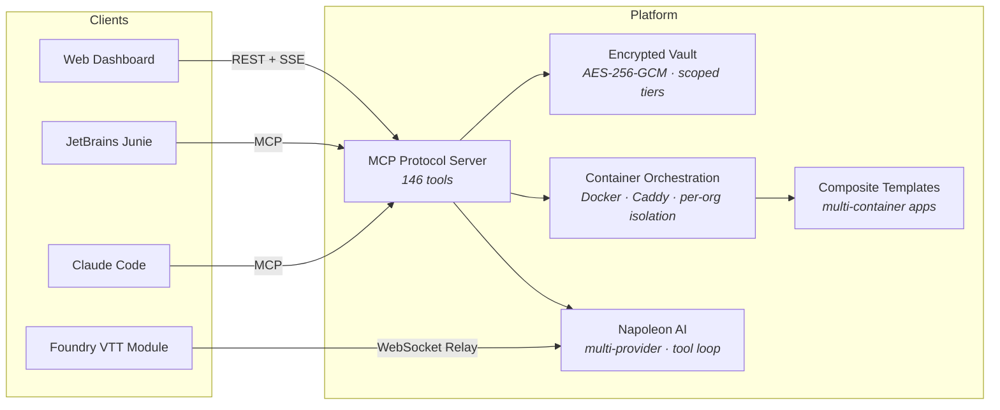

<h1 align="center">Greg Barker</h1>

  <strong>Platform engineer · AI systems · Data analytics</strong> 
  Building tools that give developers (and game masters) superpowers.

  <a href="https://stablepiggy.com">stablepiggy.com</a> · 
  <a href="https://www.linkedin.com/in/greg-barker-savevsgames/">LinkedIn</a> · 
  <a href="https://github.com/savevsgames">GitHub</a>

---

## What I'm building

### StablePiggy DevVault

A multi-tenant developer platform where AI agents operate inside isolated, sandboxed environments — managing containers, vaults, knowledge bases, and deployment pipelines through a unified MCP protocol interface.

Napoleon, the platform's AI assistant, helps developers ship code through managed infrastructure — all within the org-scoped, security-audited system. As a representation of a containerized integration, Napoleon can help game masters run tabletop RPG sessions in Foundry VTT with real module context. Any container run on the platform can be spun up and have integrations built to allow Napoleon to interact with it. 

**What's under the hood:**

- **2,800+ tests** across backend and dashboard, enforced by CI on every PR
- **16-phase security audit** — zero critical findings, comprehensive threat model with attack trees, GDPR erasure cascade, incident response runbooks
- **Composite template system** for multi-container apps with lifecycle-scoped volumes (runtime / data / service separation)
- **Encrypted vault** with tiered access (personal → org → platform), per-key AAD, automated key rotation tooling
- **Secret redaction engine** — pattern-based scrub on chat persistence, tool-annotated `_secret_payload` protocol, one-shot reveal UX
- **Container hardening** — cap-drop ALL, no-new-privileges, read-only rootfs, non-root, per-session egress rules via iptables
- **MCP compatibility** across Claude Code, Junie CLI, and Codex, with integrations for Ollama and OpenRouter in the online chat interface. Nearly 200 custom tools with automated setup scripts and diagnostic tooling
- **Waitlist + seat-capacity system** with controlled onboarding, honeypot defense, HMAC tombstones for re-signup prevention

### Napoleon Foundry Module

An AI game master assistant for [Foundry VTT](https://foundryvtt.com/) — available on [Docker Hub](https://hub.docker.com/r/savevsgames/napoleon-foundry) and pending Foundry marketplace review.

Napoleon reads real module content (actors, scenes, journals) from purchased adventure modules and answers questions, builds encounters, places walls and lighting, and manages session continuity — all from inside the Foundry interface. Trough entries are scoped to the user who owns them only and cannot be shared with other users ensuring data sovereignty.

- **Derived Docker image** (`savevsgames/napoleon-foundry`) bakes the module into `felddy/foundryvtt:13` with version-tracked releases
- **Per-org relay isolation** — each game master's WebSocket relay runs in its own container with a minted, revocable API key
- **Five-case loud-failure UX** — missing auth token, wrong relay URL, malformed URL, auth rejected, relay unreachable — each with actionable Foundry notifications

### PromptBlocker

PromptBlocker is a Chrome Extension that automatically replaces your real personal information (name, email, phone, etc.) with aliases when using AI chat services like ChatGPT, Claude, Gemini, Perplexity, and Copilot. It's development formed the basis of my zero trust approach to designing StablePiggy.

Key Features:

- **Bidirectional Aliasing**: Encode requests (real → alias), decode responses (alias → real)
- **5 AI Platforms**: ChatGPT, Claude, Gemini, Perplexity, Copilot (98% market coverage)
- **AES-256-GCM Encryption**: Firebase UID-based key derivation (enterprise-grade security)
- **FREE + PRO Tiers**: Basic protection free forever, advanced features $4.99/mo
- **750 Passing Tests**: Enterprise-grade test coverage (697 unit + 53 integration)
- **Local-First Privacy**: Profiles never leave your device (zero-knowledge architecture)

---

## What I've shipped professionally

### Data Analytics & Business Intelligence

Founding member of a consultancy delivering data analytics and BI solutions. Headline engagement:

- **$2.5M in inventory savings** identified through predictive modeling and demand forecasting for a consumer goods client
- Built automated BI reporting pipelines with triggers, analysis models for sales orders, production actual vs forecast, material costs and more - in addition to building executive dashboards
- Delivered actionable recommendations that drove procurement and logistics decisions
- Creating our own Java application SaaS that allows enterprise users to safely and deterministically query their own data in natural language (NLP to SQL).

---

## Stack

What I actually use in production, not what I've touched once in a tutorial.

| Domain | Technologies |
|--------|-------------|
| **Platform & Infrastructure** | Node.js, TypeScript, Express, SQLite (WAL), Docker, Caddy, pm2, GitHub Actions CI/CD |
| **AI & LLM Integration** | Anthropic Claude, OpenAI, OpenRouter, MCP Protocol, RAG with Voyage embeddings, multi-provider tool loops |
| **Security** | AES-256-GCM vault encryption, Argon2id password hashing, JWT with revocation, HMAC webhook verification, CSP/HSTS headers, per-container egress firewalling |
| **Frontend** | React, Vite, Tailwind CSS, SSE streaming, WebSocket |
| **Data & Analytics** | Python, pandas, predictive modeling, BI reporting, demand forecasting |
| **Protocols** | MCP (Model Context Protocol), WebSocket relay, Stripe webhooks, GitHub App webhooks, Foundry VTT module API |

---

## Background

Full stack development program at the University of Toronto. Former Master Electrician — the kind of background where you learn that cutting corners on safety gets people hurt, which turns out to be a useful instinct when you're writing security audits and building vault encryption systems.

---

  StablePiggy: <a href="https://stablepiggy.com">stablepiggy.com</a> · 
  <a href="mailto:greg@stablepiggy.com">greg@stablepiggy.com</a> ·  
  Other Inquiries: <a href="mailto:greg@stablepiggy.com">gregcbarker@gmail.com</a> · 
  <a href="https://www.linkedin.com/in/greg-barker-savevsgames/">LinkedIn</a> ·

